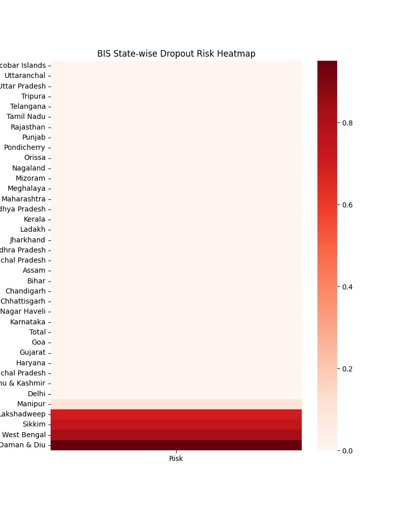

🎓 Intelligent Student Dropout Risk Prediction Using Hybrid Metaheuristic Optimizers.
📌 Project Overview

Student dropout is a critical challenge faced by educational institutions, especially in developing regions. Early identification of dropout risk helps policymakers and institutions design timely interventions.

This project presents an Intelligent Student Dropout Risk Prediction System using a deep learning LSTM model optimized with multiple hybrid metaheuristic algorithms. Since real-world government education datasets often lack explicit dropout labels, a derived dropout risk index is constructed using enrollment transitions across education levels.

The system predicts a continuous dropout risk score (0–1) and provides visual analytics for policy-level decision-making.

🎯 Objectives

Predict dropout risk using enrollment transition patterns

Handle real-world government datasets with missing values

Apply hybrid optimization algorithms to tune LSTM hyperparameters

Generate interpretable visual outputs (graphs & heatmaps)

Provide a scalable, research-ready ML pipeline

🧠 Methodology
🔹 Data Source

Government education statistics dataset containing:

Primary, Upper Primary, Secondary, and Higher Secondary enrollments

Gender-wise and total student counts

State/UT-level aggregation

🔹 Derived Dropout Risk Formula

Since no explicit dropout label exists, dropout risk is computed as:

Dropout Risk =
Average of:
(Primary → Upper Primary decline)
(Upper Primary → Secondary decline)
(Secondary → Higher Secondary decline)

The final risk score is normalized to [0, 1].

🤖 Model Architecture
Core Model

LSTM (Long Short-Term Memory) Neural Network

Suitable for sequential and trend-based learning

Optimization Strategy

Hybrid metaheuristic algorithms are used to optimize:

Number of LSTM units

Dropout rate

🔁 Hybrid Optimization Models Implemented
Prefix	Hybrid Model
pis_	AIS + PSO
psa_	CSA + PSO
bis_	AIS + BA
bso_	BA + PSO
bsa_	BA + CSA
hybrid_	AIS + CSA

Each hybrid model:

Performs global exploration + local exploitation

Produces separate models, metrics, graphs, and result files

📊 Outputs Generated
📁 Saved Artifacts

Trained LSTM model (.h5)

Feature scaler (.pkl)

Model configuration (.yaml)

Performance metrics (.json)

Predictions (.csv, .json)

📈 Visualizations (Shown & Saved)

Model performance (R² score)

Actual vs Predicted comparison graph

Dropout risk distribution

State-wise dropout risk heatmap

📂 Project Directory Structure
Student Dropout Risk Prediction/
│
├── models/
│   ├── pis_dropout_lstm_ais_pso.h5
│   ├── psa_dropout_lstm_csa_pso.h5
│   ├── bis_dropout_lstm_ais_ba.h5
│   ├── bso_dropout_lstm_ba_pso.h5
│   ├── bsa_dropout_lstm_ba_csa.h5
│
├── artifacts/
│   ├── *_scaler.pkl
│   ├── *_results.json
│   ├── *_config.yaml
│
├── results/
│   ├── *_final_results.csv
│   ├── *_predictions.json
│
├── graphs/
│   ├── *_accuracy_r2.png
│   ├── *_comparison_graph.png
│   ├── *_risk_distribution.png
│   ├── *_risk_heatmap.png
│
├── RS_Session_254_AU_352.B.csv
└── README.md

📈 Evaluation Metrics

Since the task is regression-based, the following metrics are used:

Mean Squared Error (MSE)

R² Score

Higher R² and lower MSE indicate better predictive performance.

🛡️ Data Handling & Robustness

✔ Handles missing values using median imputation
✔ Prevents division-by-zero errors
✔ Removes infinite values
✔ Works with real government datasets
✔ No manual preprocessing required

🏛️ Use-Cases

Government education departments

Policy and planning agencies

University academic analytics

Educational NGOs

Research & academic projects

🚀 How to Run

Place the dataset inside the project folder

Run any hybrid script:

python student_dropout_lstm_bsa_ba_csa.py

View outputs in:

results/

graphs/

models/

🔮 Future Enhancements

Comparison dashboard across all hybrid models

Time-series multi-year dropout forecasting

Low / Medium / High risk classification

Web-based analytics dashboard

Integration with institutional MIS systems

📚 Technologies Used

Python 3.11

TensorFlow / Keras

Scikit-learn

NumPy, Pandas

Matplotlib, Seaborn

Metaheuristic Optimization Algorithms

👨‍💻 Author

Sagnik Patra
AI & Machine Learning Researcher
Hybrid Optimization & Educational Analytics
